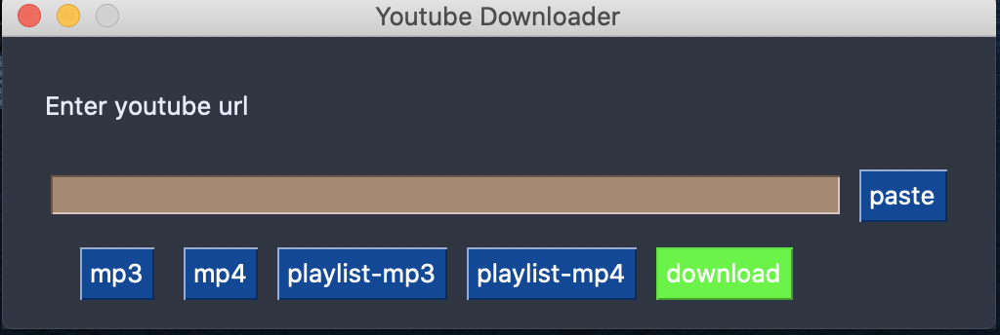

# Youtube Downloader (YD)

# Description

YD is a program that allows you to download youtube videos either as an mp4 or mp3. The end goal of the program is to have a GUI to allow for easier user interactions and to allow for playlist downloads. I made this program specifically for my father (running windows, while I run macOS) and as such tried to make it as simple as possible for him only catering to his needs and wants and nothing else.

# How it works

This is how it looks: 



As you can see, there are 5 buttons at the bottom and their text describes what format to download the youtube video as. 
To download a video, copy the link and click the paste button then click the format you want the youtube video to be downloaded as. To download multiple videos, simply follow the previous instructions of downloading a single video ensuring that you click to correct format you want each youtube video to be downloaded as. Once you are confident that you are ready to download all the videos, simply click download and the magic begins. The window closes itself upon completion.


# Installation

Ensure install ffmpeg [from here](https://github.com/adaptlearning/adapt_authoring/wiki/Installing-FFmpeg) or [here](https://www.ffmpeg.org/download.html).

Next, ensure the latest version of python is installed from [here](https://www.python.org/downloads/). Then create a virtual environment and clone the repo using the commands below:

```
$ git clone https://github.com/infectious42/youtube-downloader.git
$ cd youtube-downloader
$ python3 -m venv venv # just python on windows not python3
$ source venv/bin/activate # .\venv\Scripts\activate on windows
$ pip install pytube youtube_dl pyinstaller PySimpleGUI pyperclip
$ python3 main.py
```

# Build

To build the program into an executable for your respect machine, simply run:

```
$ python3 setup.py
```

The executable should be located in ```dist/```.
